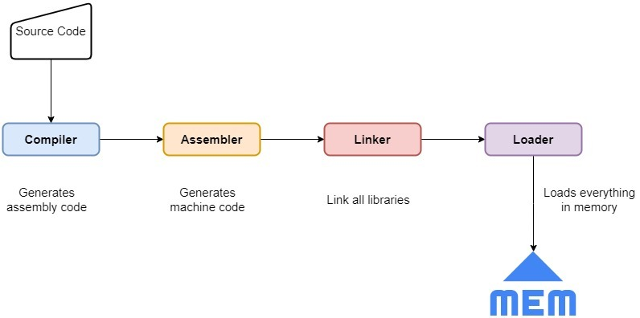

### To execute a program = Source Code => Machine Code

- compile the code -> intermediate level
- convert to assembly-level code
- link with other external libraries or components
- load it in memory
- execute the code

     


## Compiler

- Program -> Assembly Lang Code
- AL - specific to each machine or OS
- Reads source in single pass and checks lang token
- Checks Semantic Rules

## Assembler

- Assembly Code - Machine Code , stores in Object file(Binary)
- Assigns memory for instructions and objects 

## Linker

- Creates final executable after linking external files
- Resolves absolute mem location where code needs to be loaded

## Loader

- Loads the executable to Memory.
- Creates program , data stack , registers and gives control to CPU to execute the code.

### Process Vs Thread

### Context Switching

&nbsp;
&nbsp;

# Memory Management

### Heap Memory
### Stack Memory
### Code Section

&nbsp;

- Static Memory Allocation
- Dynamic Memory Allocation

### Dynamic Memory Allocation
&nbsp;
&nbsp;


- ## malloc()

    - ***ptr = (cast-type*) malloc(byte-size)***

    ptr = (int*) malloc(100 * sizeof(int));

    - size of int is 4 bytes - allocates 400 bytes of mem
    - pointr holds addr of first byte of the allocated mem.
    - single large block of memory with the specified size.

```C
#include <stdio.h>
int main()
{
   // This pointer will hold the
    // base address of the block created
    int* ptr;
    int n, i;
  
    // Get the number of elements for the array
    printf("Enter number of elements:");
    scanf("%d",&n);
    printf("Entered number of elements: %d\n", n);
  
    // Dynamically allocate memory using malloc()
    ptr = (int*)malloc(n * sizeof(int));
  
    // Check if the memory has been successfully
    // allocated by malloc or not
    if (ptr == NULL) {
        printf("Memory not allocated.\n");
        exit(0);
    }
    else {
  
        // Memory has been successfully allocated
        printf("Memory successfully allocated using malloc.\n");
  
        // Get the elements of the array
        for (i = 0; i < n; ++i) {
            ptr[i] = i + 1;
        }
  
        // Print the elements of the array
        printf("The elements of the array are: ");
        for (i = 0; i < n; ++i) {
            printf("%d, ", ptr[i]);
        }
    }
  
    return 0;
}
```

- ## calloc()

    - ***ptr = (cast-type*)calloc(n, element-size);***
    - ptr = (float*) calloc(5, sizeof(float));

- ## free()

    - dynamically de-allocate
    - reduce wastage of memory by freeing it

- ## realloc()

    - change the memory allocation of a previously allocated memory


